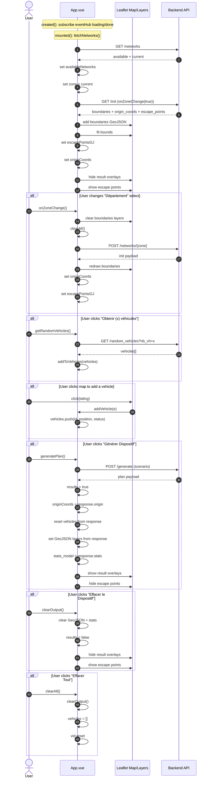

```mermaid
sequenceDiagram
  autonumber
  actor User
  participant App as App.vue
  participant Map as Leaflet Map/Layers
  participant API as Backend API

  Note over App: created(): subscribe eventHub loading/done
  Note over App: mounted(): fetchNetworks()

  App->>API: GET /networks
  API-->>App: available + current
  App->>App: set availableNetworks
  App->>App: set zone = current
  App->>API: GET /init (onZoneChange(true))
  API-->>App: boundaries + origin_coords + escape_points
  App->>Map: add boundaries GeoJSON
  App->>Map: fit bounds
  App->>App: set escapePointsGJ
  App->>App: set originCoords
  App->>Map: hide result overlays
  App->>Map: show escape points

  alt User changes "Département" select
    User->>App: onZoneChange()
    App->>Map: clear boundaries layers
    App->>App: clearAll()
    App->>API: POST /networks/{zone}
    API-->>App: init payload
    App->>Map: redraw boundaries
    App->>App: set originCoords
    App->>App: set escapePointsGJ
  end

  alt User clicks "Obtenir (x) véhicules"
    User->>App: getRandomVehicles()
    App->>API: GET /random_vehicles?nb_vh=x
    API-->>App: vehicles[]
    App->>App: addToVehicles(vehicles)
  end

  alt User clicks map to add a vehicle
    User->>Map: click(latlng)
    Map->>App: addVehicle(e)
    App->>App: vehicles.push(id, position, status)
  end

  alt User clicks "Générer Dispositif"
    User->>App: generatePlan()
    App->>API: POST /generate (scenario)
    API-->>App: plan payload
    App->>App: results = true
    App->>App: originCoords = response.origin
    App->>App: reset vehicles from response
    App->>App: set GeoJSON layers from response
    App->>App: stats_model = response.stats
    App->>Map: show result overlays
    App->>Map: hide escape points
  end

  alt User clicks "Effacer le Dispositif"
    User->>App: clearOutput()
    App->>App: clear GeoJSON + stats
    App->>App: results = false
    App->>Map: hide result overlays
    App->>Map: show escape points
  end

  alt User clicks "Effacer Tout"
    User->>App: clearAll()
    App->>App: clearOutput()
    App->>App: vehicles = []
    App->>App: vid reset
  end
```
